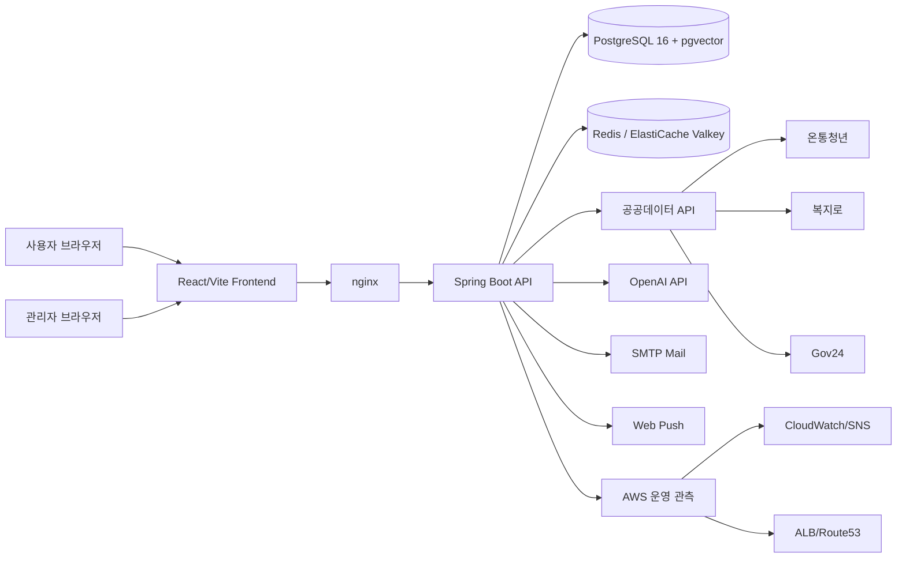
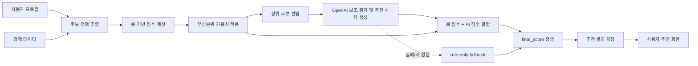
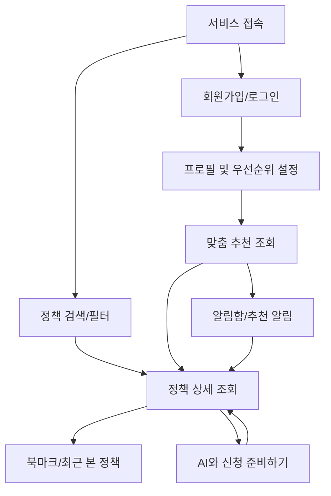
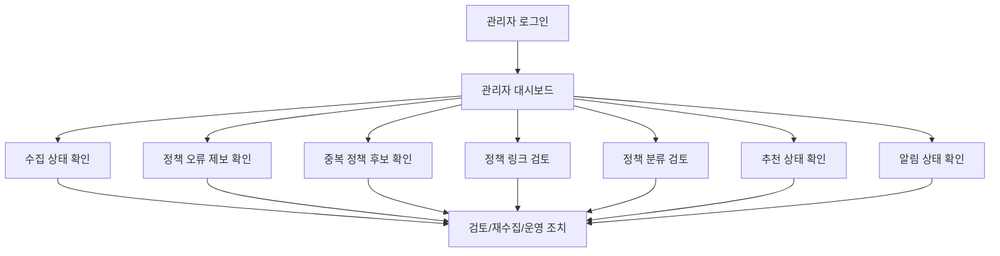

# 결과보고서 도표 및 구현 화면 삽입 계획

이 문서는 결과보고서에 삽입할 도표와 구현 화면의 위치, 목적, 제작 기준을 정리한다.

## 도표 제작 기준

- 최종 제출용 본문에는 핵심 도표 4개와 구현 화면 캡처를 중심으로 삽입한다.
- 정책 데이터 통합, 챗봇 상담 구조, 배포 구조는 본문 설명과 전체 아키텍처 안에서 함께 다루고 별도 그림 번호를 만들지 않는다.
- 도표는 코드 내부 클래스 전체가 아니라 보고서 독자가 이해할 수 있는 서비스 구조와 흐름 중심으로 단순화한다.
- 각 도표는 본문 설명 직후 배치하고, 캡션에는 그림이 설명하는 핵심을 1~2문장으로 적는다.
- 최종 제출용 한글 문서에서는 Mermaid 또는 draw.io 원본을 PNG로 변환해 삽입한다.

## [그림 1] 전체 시스템 아키텍처

삽입 위치: `제2장 제2절 1. 전체 시스템 구조`

목적: 사용자가 웹 프론트엔드에 접근하면 백엔드 API가 정책 검색, 추천, 챗봇, 알림, 관리자 기능을 처리하고, PostgreSQL/Redis/외부 API/OpenAI와 연동되는 전체 구조를 설명한다.

## [그림 2] AI 개인화 추천 파이프라인

삽입 위치: `제2장 제2절 4. AI 개인화 추천 파이프라인 설계`

목적: 추천이 AI 단독 판단이 아니라 후보 추출, 룰 점수, 우선순위 가중치, AI 보조 평가, 최종 점수 정렬의 순서로 이루어짐을 설명한다.

## [그림 3] 사용자 서비스 흐름

삽입 위치: `제2장 제2절 6. 사용자 서비스 흐름`

목적: 검색, 상세 조회, 프로필 설정, 추천, 챗봇, 북마크, 알림이 하나의 사용자 경험으로 이어짐을 보여준다.

## [그림 4] 관리자 운영 흐름

삽입 위치: `제2장 제2절 7. 관리자 운영 흐름`

목적: 관리자가 수집 상태, 정책 오류 제보, 중복 후보, 링크 검토, 추천/알림 상태를 확인해 플랫폼 신뢰성을 관리하는 흐름을 보여준다.

## 구현 화면 캡처 계획

| 그림 번호 | 화면 | 경로 | 캡처 목적 |
|----------|------|------|----------|
| 그림 5 | 메인 화면 | `/` | 서비스 첫 화면과 주요 추천/탐색 진입점을 보여준다. |
| 그림 6 | 정책 검색 및 필터 화면 | `/policies` | 키워드, 지역, 분야, 상태 필터 기반 정책 탐색 기능을 보여준다. |
| 그림 7 | 정책 상세 화면 | `/policies/{id}` | 지원 대상, 신청 기간, 지원 내용, 신청 방법, 공식 링크 제공을 보여준다. |
| 그림 8 | 마이페이지 | `/mypage` | 사용자 프로필, 개인화 기준, 우선순위, 알림 설정을 보여준다. |
| 그림 9 | 맞춤 추천 결과 | `/` 또는 추천 섹션 | 추천 정책, 추천 사유, 최종 점수 기반 정렬 결과를 보여준다. |
| 그림 10 | 챗봇 상담 | `/chat` | 자연어 질문, 정책 참조, 신청 준비 코칭 흐름을 보여준다. |
| 그림 11 | 알림함 | `/alerts` | 추천 알림과 사용자 재방문 지원 기능을 보여준다. |
| 그림 12 | 관리자 대시보드 | `/admin/dashboard` | 정책 품질, 수집, 추천, 알림 운영 상태를 보여준다. |

## 표 삽입 계획

| 표 번호 | 표 이름 | 본문 위치 | 작성 방식 |
|--------|---------|----------|----------|
| 표 1 | 구현 환경 | `제2장 제3절 1. 구현 환경` | 한글 표 기능으로 작성 |
| 표 2 | 외부 API 및 연동 서비스 사용 내역 | `제2장 제3절 2. 외부 API 및 연동 서비스 사용 내역` | 한글 표 기능으로 작성 |
| 표 3 | 주요 내부 API 엔드포인트 | `제2장 제3절 3. 주요 내부 API 엔드포인트` | 필요 시 본문 또는 부록에 배치 |
| 표 4 | 테스트 및 검증 결과 | `제3장 제2절 테스트 및 검증 결과` | 한글 표 기능으로 작성 |
| 표 5 | 운영 환경 응답성 검증 요약 | `제3장 제2절 테스트 및 검증 결과` | 검증 보조 자료로 짧게 배치 |

## 캡처 기준

- 기본 해상도: 데스크톱 1440px 폭
- 필요 시 모바일 화면은 부록 또는 발표자료용으로 별도 캡처
- 실사용 개인정보가 보이지 않도록 테스트 계정으로 촬영
- 관리자 화면은 민감한 운영 값이 보이지 않는 범위로 캡처
- 캡션에는 화면이 증명하는 기능을 명확히 작성
